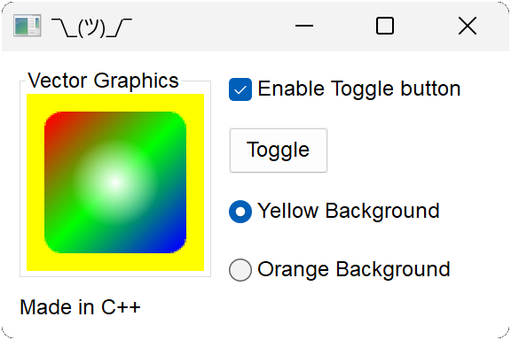
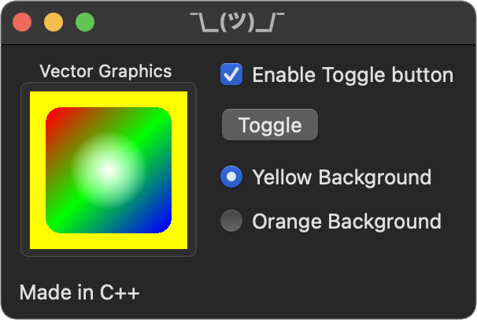
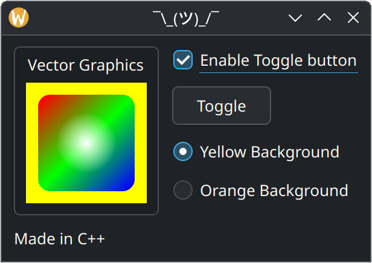

# Nux 0.1 Beta

Nux stands for Native User eXperience. It is a C++ library for creating
cross-platform GUIs with fully native widgets like push buttons, labels,
check boxes, and so on. Nux was made from scratch, meaning it has no
third-party dependencies beyond the standard library and each operating
system's native API. It is built through CMake and supports Windows, macOS
and KDE-powered Linux distributions. On Windows it uses the standard Win32
API, on macOS it uses the standard AppKit API, and on Linux it uses Qt 6.
The widgets provided by Nux are actually native, they are not emulated.

# Native GUIs

With Nux, you can create a GUI once and have it adopt the underlying
platform's standard look and feel, regardless of whether you're on Windows,
macOS or a KDE-powered Linux distribution. Nux doesn't support GTK, so if
you use Nux on GNOME then you won't get native widgets, Qt will emulate
them instead.

# Vector Graphics

In addition to native widgets, Nux also supports portable,
hardware-accelerated vector graphics. You add a graphics box widget to your
window and assign a render event handler to perform custom rendering. You
can render shapes with solid colors or linear/radial gradients. On Windows,
Nux uses Direct3D 11, whereas on macOS and Linux it uses OpenGL. I am
considering adding support for Metal in the future, if I have time.

# C++, C, C#, Swift and Rust

Nux is natively made in C++ but it is also available in C, C#, Swift and Rust.
The 'Hello' example is a simple example implemented in each of those languages
to showcase Nux's native widgets and custom vector graphics and the several
language bindings that come out of the box.

# Low Resolution GIF

# Screenshots

# License

Nux is released under the MIT license, which means that it is free to use,
even in commercial software. It is still in Beta, so my recommendation is
that you don't use it in production software just yet. I can't make any
promises right now because this is a volunteer project and I don't have
funding.

# Author

Nux Copyright (c) 2025 Daniel T. McGinnis.
