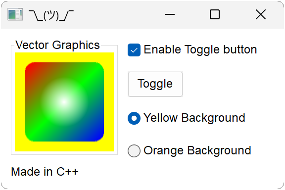
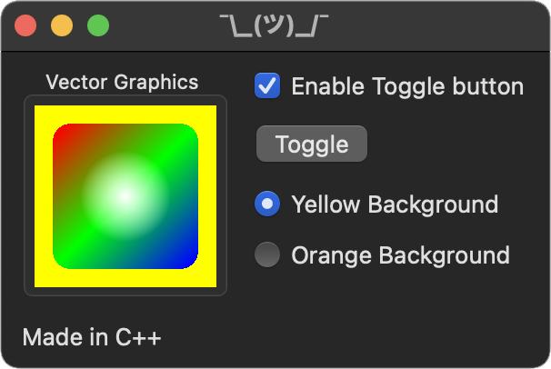
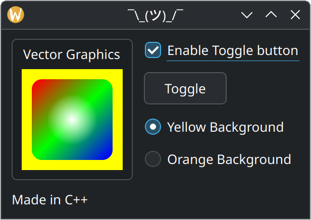

# Hello

This example showcases using Nux from C++, the native language Nux is made in.
The other examples are the same as this one but in other languages, showcasing
the several bindings that come out of the box with Nux.

# Build and Run

1. Clone the repo to a directory of your choice. For this example, we'll call it *nux*.
2. Create a build directory outside of *nux*. For this example, we'll call it *build*.
3. Run `cmake -G (pick a generator) ../nux` in the build directory.
4. Run `cmake --build .` in the build directory.
5. Run `cd examples/hello`
5. Run `./hello` (macOS and Linux) or `.\hello.exe` (Windows).
6. This is what you'll get, depending on your platform:

