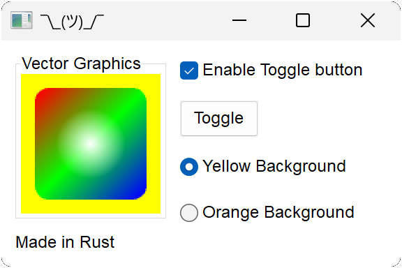
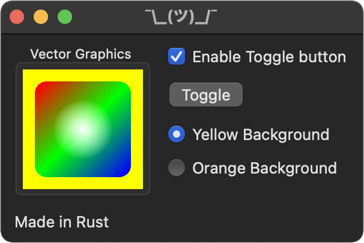
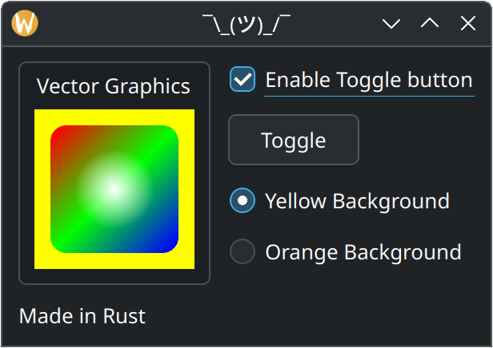

# Hello Rust

This example showcases using Nux from Rust.

# Build and Run

1. Clone the repo to a directory of your choice. For this example, we'll call it *nux*.
2. Create a build directory outside of *nux*. For this example, we'll call it *build*.
3. Run `cmake -G (pick a generator) ../nux -DNUX_BUILD_RS=1` in the build directory.
4. Run `cmake --build .` in the build directory.
5. Run `cd examples/hellors/hellors`
5. Run `cargo run`.
6. This is what you'll get, depending on your platform:

