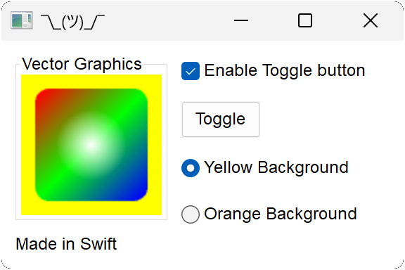
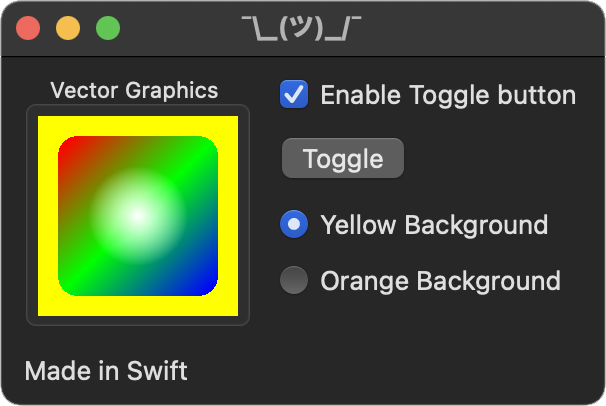
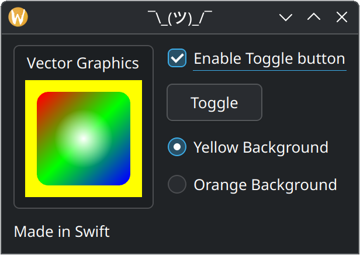

# Hello Swift

This example showcases using Nux from Swift.

# Build and Run

1. Clone the repo to a directory of your choice. For this example, we'll call it *nux*.
2. Create a build directory outside of *nux*. For this example, we'll call it *build*.
3. Run `cmake -G (pick a generator) ../nux -DNUX_BUILD_SWIFT=1` in the build directory.
4. Run `cmake --build .` in the build directory.
5. Run `cd examples/helloswift/helloswift`
5. If you're on macOS or Linux, run `swift run` or `./helloswift`.
6. If you're on Windows, run `.\.build\debug\helloswift.exe` but not `swift run`.
   * On Windows, `swift run` discards the manifest file, which is necessary to enable visual styles.
7. This is what you'll get, depending on your platform:

    
    
    

